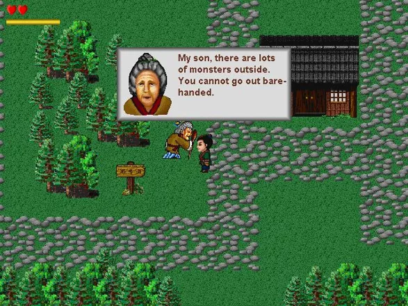
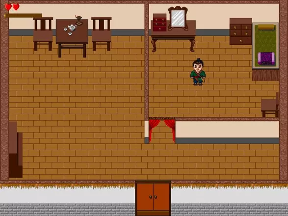
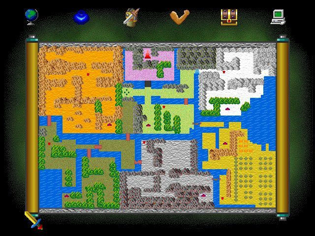

# Legend of LuWa

**Legend of LuWa** is a reverse-engineering, wiki, and preservation project for an obscure 2002 Windows action-adventure game of the same name (version 2.4e; © 1999–2001 Beijing PingYi Software Co. Ltd., © 2002 Loowa Software Company). When this project started there was essentially no walkthrough, item guide, or wiki for the game anywhere online — just a MobyGames stub and a couple of store pages. The goal is to document the whole game — items, weapons, treasures, kungfu, bosses, areas, and hidden rooms — plus a full walkthrough, and to publish a wiki. The twist that makes a one-person wiki realistic: almost every fact here is extracted and **verified directly from the game's data files by byte-level reverse engineering**, not from memory. Solo project.

  
  
  

<i>Left → right: overworld exploration &amp; dialogue · the starting house · the world map of all six regions.</i>

## The game

A real-time fighting adventure set in mythical ancient China. You play **LuWa**, a teenage warrior whose village was attacked; you must defeat **Monster WuXing** in **Xuan Tower** and save the **Green Angel**. The world spans six areas — Greenfield, Yellowfield, Forest, Gold Mine, Desert, Snow Mountains — before the final tower. Progression is measured largely by your sword, which upgrades across five tiers:

| Sword | Attack |
|---|---|
| Practise | 6 |
| Bravery | 15 |
| Dragon | 30 |
| Fire | 60 |
| Xuan | 100 |

*© 1999–2001 Beijing PingYi Software Co. Ltd. — © 2002 Loowa Software Company.*

## How it works (the method)

The game ships its content in custom `*.add` data files. NPC dialog, item names, quest wiring, and room layouts are pulled straight out of those files and cross-checked against byte offsets. Because the environment has **no Python** (Store stub only) and **no `strings` binary**, extraction is done with PowerShell (`[IO.File]::ReadAllBytes` + `BitConverter`) and `tr -c [:print:]`.

The `Area.add` map format was decoded to the point of reading rooms directly:

- Maps are stored as chunks — e.g. `Dun40xx` is Monster Gold's castle, `Dun60xx` is the final dungeon.
- Rooms are **31×26 tiles**.
- Objects are typed records: `[type][namelen][name][x][y]`.
- Walls are `"Brick"` objects.
- Rare edge **type IDs** distinguish real doorways from plain walls (`0x7e`–`0x81` = ordinary wall) — which is how hidden, doorless rooms get found.

Full format notes live in [`research/file-formats.md`](research/file-formats.md).

## Repository layout

| Path | Contents |
|---|---|
| [`installer/`](installer/) | `setup.exe`, `disk1.pak` (the full game, compressed), `_fix/` (cnc-ddraw lag fix + shaders), `Install Legend of LuWa with Fix.bat`, and [`READ ME FIRST.txt`](installer/). |
| [`game-data/`](game-data/) | The tracked data files: `Area.add`, `Item.add`, `Spc.add`, `Show.add`, `World.add`, and the WinHelp manual (`Luwa.hlp` + `Luwa.cnt`), plus a `README.md`. (`Pic.add` graphics ~20 MB and `Wave.add` audio are not tracked.) |
| [`research/`](research/) | `manual.txt` (extracted manual), `area_strings_offset.txt` (every `Area.add` string with its byte offset), `area_script_text.txt` (the full game script / dialog), and [`file-formats.md`](research/file-formats.md) (the decoded formats). |
| [`findings/`](findings/) | [`README.md`](findings/README.md) index + [`TEMPLATE.md`](findings/TEMPLATE.md) + numbered discovery files, each backed by byte-offset evidence. |
| [`wiki/`](wiki/) | [`README.md`](wiki/README.md) (page plan) + `items.md` (seeded items / weapons / treasures / kungfu page). |
| [`screenshots/`](screenshots/) | Captured images of the game — `overworld-dialog.webp`, `starting-house.webp`, `world-map.jpg`. |
| root | `README.md`, `CLAUDE.md`, `LICENSE`, `.gitignore`. |

## Highlights / discoveries

Each finding in [`findings/`](findings/) carries its own byte-offset evidence. Two favorites so far:

- **#0001 — The Warm Ball.** A quest "precious stone" you trade to a freezing-cave NPC to obtain the **Fire Sword** (attack 60, the fourth of five blades). It's the reward for saving an old man's granddaughter — a choice between 1000 coins or the Warm Ball (the data shows you can even swap the coins for it later). Proven from `Area.add` dialog at byte offsets **663098** and **708672**.
- **#0002 — The doorless secret room.** After the Golden Monster boss (**Monster Gold**), map `Dun4021` is the grandmother's cell, holding the **Ex-Jade** — the magical item Monster Gold kidnapped her for. The room has **no normal door**; the entrance is a walk-through **fake wall** on its top edge (which is why DirtBombs don't work on it). It was located by scanning the room's edge type IDs and spotting the one edge tile that isn't an ordinary wall (`0x7e`–`0x81`).

## How to read it

- **Just want to play through?** Start with the highlights above, then browse [`wiki/`](wiki/) for the item and area pages.
- **Want to verify a claim?** Every entry in [`findings/`](findings/) cites byte offsets. Open the referenced file in [`research/`](research/) — e.g. `area_strings_offset.txt` maps every string to its offset in `Area.add` — and check the bytes yourself.
- **Want to extend the research?** [`research/file-formats.md`](research/file-formats.md) documents the decoded `*.add` formats; [`findings/TEMPLATE.md`](findings/TEMPLATE.md) is the format for logging a new discovery with evidence.
- **Want to run the game?** See [`installer/READ ME FIRST.txt`](installer/), then run `Install Legend of LuWa with Fix.bat`. The bundled **cnc-ddraw** fix in `installer/_fix/` wraps the game's 2002 DirectDraw rendering so it runs smoothly on Windows 10/11.

> **Antivirus note:** some antivirus tools may flag the cnc-ddraw `ddraw.dll` in `_fix/`. This is a **known false positive** for graphics wrappers, not malware.

## Status

Work in progress. The data-extraction tooling and the `Area.add` format are decoded and documented, findings are being logged one at a time with evidence, and the wiki pages are being seeded from those findings.

## Legal & preservation

Legend of LuWa is treated here as **abandonware**: it dates to 2002 and has no active publisher (both Loowa Software Company and Beijing PingYi Software Co. Ltd. are defunct). The installer and data files are included strictly for **preservation and research**. If you own the rights and would like something removed, open an issue and it will be taken down on request.

*Legend of LuWa © 1999–2001 Beijing PingYi Software Co. Ltd.; © 2002 Loowa Software Company.* The **MIT license covers only the original documentation, research notes, and tooling** in this repository. The game itself and all of its assets remain the property of their original owners.

## License

[MIT](LICENSE) — applies to the original documentation, research, and tooling only (see the note above). Game binaries and assets are not covered.

---

Solo project by [AlexTuring010](https://github.com/AlexTuring010).
